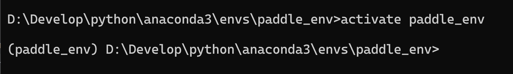
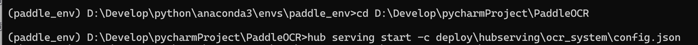
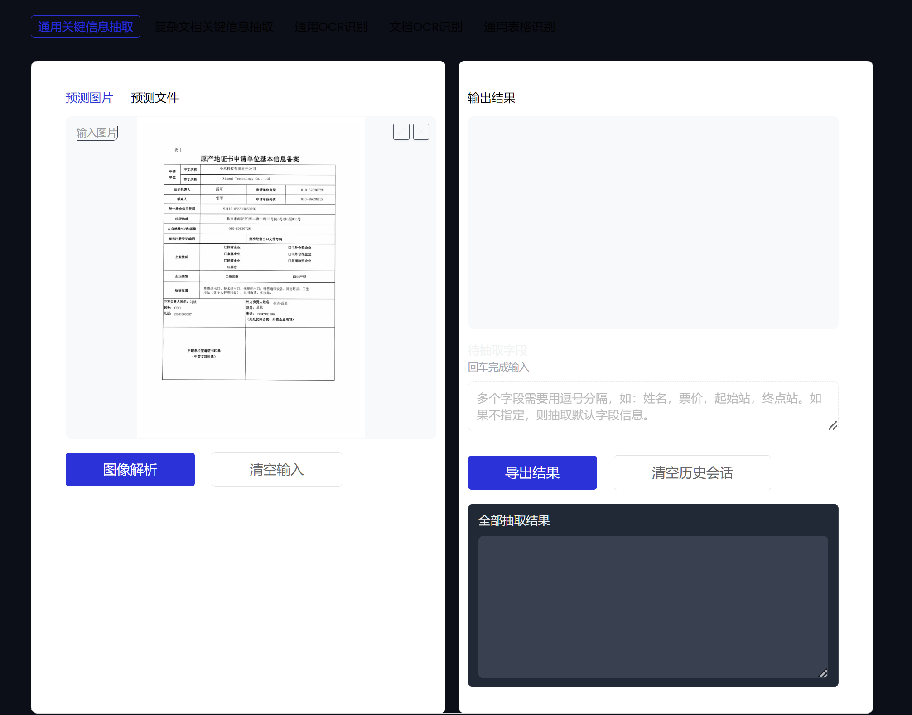
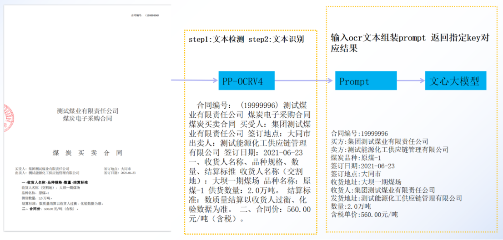

## 思路

OCR->图片->双层pdf->NLP->信息提取（正则）/摘要（大模型）

### 不可复制的PDF转成双层可复制PDF

https://www.cnblogs.com/xiaohemiao/p/17803534.html

### 实现步骤

1. 转PDF为图片；
2. 使用PaddleOCR 对提取图片的内容及坐标；
3. 把坐标根据缩放比转成相对于PDF的坐标，并使用PDFsharp（IText？） 重新生成PDF，如需要保持原有格式需要把1转成的图片重新回写到生成的pdf，文字层为ocg层；
4. 实现双层pdf的效果。

### 功能

1. 上传文档并提取所有文本；
2. 提取和框选提取可复制和不可复制pdf；
3. 转换不可复制的pdf为双层可复制pdf；


## 1. PDF转图片

使用开源库Apache PDFBox将PDF转换为图片

1. **引入依赖库**

```xml
<dependency>
			<groupId>org.apache.pdfbox</groupId>
			<artifactId>fontbox</artifactId>
			<version>2.0.9</version>
		</dependency>
		<!-- <https://mvnrepository.com/artifact/org.apache.pdfbox/pdfbox> -->
		<dependency>
			<groupId>org.apache.pdfbox</groupId>
			<artifactId>pdfbox</artifactId>
			<version>2.0.9</version>
		</dependency>
		<!-- <https://mvnrepository.com/artifact/commons-logging/commons-logging> -->
		<dependency>
			<groupId>commons-logging</groupId>
			<artifactId>commons-logging</artifactId>
			<version>1.2</version>
		</dependency>
```

1. **实现pdf转换图片工具类**

（多页pdf会生成多页的图片，后缀会生成图片的位置序号）

```java
public class Pdf2Png {
}
```

## 2. PaddleOCR提取图片文本，输出内容坐标

ppocr输出:

身份证：

```json
{msg=, results=[[{confidence=0.9981573224067688, text=姓名代用名, text_region=[[49, 68], [194, 68], [194, 94], [49, 94]]}, {confidence=0.9997122883796692, text=性别男, text_region=[[47, 116], [141, 116], [141, 142], [47, 142]]}, {confidence=0.9986172318458557, text=民族汉, text_region=[[190, 118], [274, 118], [274, 141], [190, 141]]}, {confidence=0.9980959892272949, text=出生2013年05月06, text_region=[[50, 164], [317, 164], [317, 186], [50, 186]]}, {confidence=0.9929761290550232, text=住址湖南省长沙市开福区巡道街, text_region=[[46, 209], [382, 210], [382, 235], [46, 234]]}, {confidence=0.9903236627578735, text=幸福小区居民组, text_region=[[117, 241], [272, 241], [272, 264], [117, 264]]}, {confidence=0.9983522295951843, text=公民身份证号码, text_region=[[51, 335], [191, 335], [191, 355], [51, 355]]}, {confidence=0.9979677200317383, text=430512198908131367, text_region=[[229, 335], [553, 335], [553, 355], [229, 355]]}]], status=000}
```

发票(results部分)：

```json
发票代码：044032200111发票号码：28164546国统开票日期：2022年12月03日深圳市税务局机器编号：校验码：09976900364593599737917001472768名称：太极计算机股份有限公司0009＊0/3>9<<1*8＊＊3636<<</-0-购纳税人识别号：9１１１0000１0１13７049C**/08*/3518670>+31641-2>5/<-买码地址、电话:>9*>5-38955>7<04+30<6<>41*63方区开户行及账号：<+623+07*1-642014<9/19*9>310单位项目名称规格型号数量单价金额税率税额免税*餐饮服务*餐饮服务283.00283.00***1合计¥283.00贰佰捌拾叁圆整价税合计(大写)（小写）¥283.00名称：深圳市珍湘味饮食文化有限公司销备纳税人识别号：91440300MA5G4A9QXN售地址、电话：107523975507深圳市福田区莲花街道彩虹社区莲花支路1011号润鹏花园莲花路1092号11方注开户行及账号：中国民生银行深圳彩田支行161984645开票人：汪永香91440300MA5G4A9QXN复核：陈凌收款人：汪燕珍销售方：（章发票专用章
```


**1. text_region=[左上，右上，右下，左下] **

```json
Text: 被证明是视觉数据模型的有效表示。, Text Region: [[2049, 5384], [3283, 5384], [3283, 5478], [2049, 5478]]
```


**2.原点是左上**

**3. [x,y]** 

图片和pdf的坐标进行转换，图片坐标00是左上，pdf是左下;
pdf转成等高的图片函数
var pdfWidth = (int)document.PageSizes[page].Width * 4 / 3;
var pdfHeight = (int)document.PageSizes[page].Height * 4 / 3;
得到的bbox是相对于图片的坐标，根据上述的pdfWidth 、pdfHeight 等比例转成pdf坐标即可；
可以把bbox用gdi+绘制到图片上，先后先向pdf写图片，在写相对的文字，就可以有个明显的对比


PDFBox中的[坐标系](https://so.csdn.net/so/search?q=坐标系&spm=1001.2101.3001.7020)

PDFBox中的坐标位置：PDFBox中是以页面左下脚为坐标圆点，水平方向是x轴，垂直方向是y轴，如下图所示：


另外，PDFBox中一般是使用【pt】作为单位，有时候我们可能会遇到【px】像素单位，所以就需要将pt和px单位进行换算，pt和px单位转换关系是：【1pt= 1px * 3 / 4】。


## 3. 部署ppocr服务，实现身份证识别

1. 进入 ```
   <LOCAL_PATH_REDACTED>
2. 激活虚拟环境
3. 基于PaddleHub Serving的服务部署
   ```
   cd <LOCAL_PATH_REDACTED>
   hub serving start -c deploy\hubserving\ocr_system\config.json
   ```
   

4. 运行PpocrDemoApplication

## UI参考

[PaddleX | PP-ChatOCRv2_AI应用-飞桨AI Studio星河社区](https://aistudio.baidu.com/application/detail/10368)



## 提取关键信息prompt

prompt = 

```
你现在的任务是从OCR文字识别的结果中提取我指定的关键信息。

OCR的文字识别结果使用符号包围，包含所识别出来的文字，顺序在原始图片中从左至右、从上至下。

我指定的关键信息使用[]符号包围。请注意OCR的文字识别结果可能存在长句子换行被切断、不合理的分词、对应错位等问题，你需要结合上下文语义进行综合判断，以抽取准确的关键信息。

在返回结果时使用json格式，包含一个key-value对，key值为我指定的关键信息，value值为所抽取的结果。如果认为OCR识别结果中没有关键信息key，则将value赋值为“未找到相关信息”。 请只输出json格式的结果，不要包含其它多余文字！下面正式开始：

OCR文字：${ocr_result} 要抽取的关键信息：[${key1},${key2}...]。
```

##  图片资料



